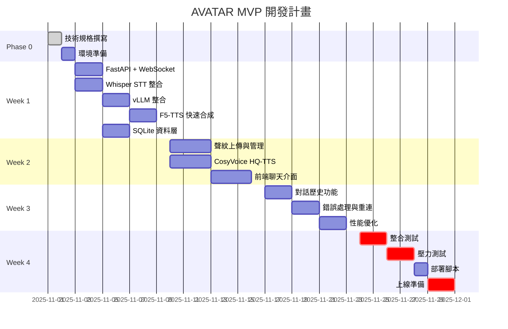

# AVATAR - 開發進度報告

> 更新日期: 2025-11-01
> 開發狀態: In Development (Phase 1 → Phase 2 Transition)
> 完成度: 20%
> Sprint: 1 (Week 0-1: 環境準備 → 核心開發)

---

## 📊 總體進度概覽

### 當前里程碑
- **Milestone**: MVP 技術規格完成 ✅
- **下個里程碼**: Week 1 - 核心流程打通
- **預計上線**: 2025-12-01（4 週）

### 實際進度
```
[====................] 20% (Phase 1 基礎完成)

Phase 0: 規劃        ████████████████████ 100% ✅
Phase 1: 環境準備    ████████------------ 40% ✅
Phase 2: 核心開發    -------------------- 0%
Phase 3: 測試上線    -------------------- 0%
```

### 關鍵風險
| 風險 | 狀態 | 緩解措施 |
|:---|:---|:---|
| VRAM 不足導致 OOM | 🟡 中 | 已規劃限流與降級策略 |
| HQ-TTS 載入延遲 | 🟡 中 | 預熱機制 + 進度提示 |
| 開發時程緊迫 | 🟠 高 | 採用 Linus 式精簡架構 |

---

## 📈 開發進度時間軸（Gantt）



---

## ✅ 功能開發狀態

### 已完成（Week 0 - Phase 1）
- ✅ MVP 技術規格文檔
- ✅ 開發進度報告模板
- ✅ 目錄結構規劃
- ✅ TaskMaster 專案初始化
- ✅ GitHub 倉庫建立 (https://github.com/Zenobia000/AI-assistant_bot)
- ✅ Poetry 虛擬環境配置
- ✅ 基礎依賴安裝 (FastAPI, Uvicorn, WebSockets, etc.)
- ✅ PyTorch CUDA 12.1 安裝 (torch 2.5.1+cu121)
- ✅ 環境驗證通過 (RTX 3090 24GB 檢測成功)
- ✅ SQLite 資料庫 schema 建立 (conversations + voice_profiles)
- ✅ WAL 模式啟用（提升並發性能）
- ✅ 資料庫初始化腳本 (scripts/init_database.py)

### 開發中（Week 1 - Phase 2）
- ⏸️ AI 模型套件安裝（延後至實際需要時）
  - [ ] vLLM (>=0.6.0) - Week 1 核心開發時安裝
  - [ ] faster-whisper - Week 1 核心開發時安裝
  - [ ] F5-TTS - Week 1 後期
  - [ ] CosyVoice3 - Week 2

**備註**: AI 模型套件在 Windows 環境安裝耗時極長，決定延後至 Phase 2 實際需要時安裝

### 待辦（Week 1-4）

#### Week 1: 核心流程打通
- [ ] **後端基礎**
  - [ ] FastAPI 專案初始化
  - [ ] WebSocket 連接處理
  - [ ] SQLite 資料庫初始化
  - [ ] 音檔存儲目錄建立

- [ ] **AI 模型整合**
  - [ ] Whisper STT 服務封裝
  - [ ] vLLM 服務調用
  - [ ] F5-TTS 快速合成

- [ ] **驗收標準**
  - [ ] 語音輸入 → 轉錄 → LLM → 快速 TTS 流程可跑通
  - [ ] E2E 延遲 < 5s（初版）

#### Week 2: 聲紋與高質 TTS
- [ ] **聲紋管理**
  - [ ] 聲音上傳 API
  - [ ] Embedding 提取
  - [ ] 聲紋列表與刪除

- [ ] **高質 TTS**
  - [ ] CosyVoice3 整合
  - [ ] 按需載入機制
  - [ ] 快/美雙檔切換

- [ ] **前端開發**
  - [ ] 聊天介面（React）
  - [ ] 麥克風錄音組件
  - [ ] 音頻播放器

- [ ] **驗收標準**
  - [ ] 聲音克隆功能可用
  - [ ] 前端可正常對話

#### Week 3: 完善功能
- [ ] **功能補完**
  - [ ] 對話歷史查詢
  - [ ] 音頻重播
  - [ ] 會話管理

- [ ] **錯誤處理**
  - [ ] WebSocket 斷線重連
  - [ ] VRAM 不足降級
  - [ ] 錯誤日誌記錄

- [ ] **性能優化**
  - [ ] VRAM 使用監控
  - [ ] 並發限流
  - [ ] 音檔壓縮

- [ ] **驗收標準**
  - [ ] E2E 延遲 P95 < 3.5s
  - [ ] 無明顯 bug

#### Week 4: 測試與上線
- [ ] **測試**
  - [ ] 單元測試（核心邏輯）
  - [ ] 整合測試（E2E 流程）
  - [ ] 壓力測試（5 並發 2 小時）

- [ ] **部署**
  - [ ] 部署腳本
  - [ ] 環境配置文檔
  - [ ] 備份腳本

- [ ] **驗收標準**
  - [ ] 通過 MVP 上線檢查清單
  - [ ] KPI 達標

---

## 🖥️ 前端開發進度

### 頁面開發狀態

| 頁面 | 路由 | 狀態 | 完成度 | 備註 |
|:---|:---|:---|:---|:---|
| 聊天介面 | `/chat` | 📝 設計中 | 0% | Week 2 開始 |
| 聲紋管理 | `/voice-profiles` | 📝 設計中 | 0% | Week 2 開始 |
| 對話歷史 | `/history` | 📝 規劃中 | 0% | Week 3 開始 |

### 核心組件狀態

| 組件 | 依賴 API | 狀態 | 完成度 |
|:---|:---|:---|:---|
| `ChatInterface` | `WS /ws/chat` | 📝 設計中 | 0% |
| `MicrophoneButton` | WebRTC API | 📝 設計中 | 0% |
| `AudioPlayer` | HTML5 Audio | 📝 設計中 | 0% |
| `ProfileList` | `GET /api/voice-profiles` | 📝 規劃中 | 0% |
| `UploadDialog` | `POST /api/voice-profile` | 📝 規劃中 | 0% |

---

## 📊 關鍵技術指標

| 指標 | 當前值 | 目標值 | 狀態 | 備註 |
|:---|:---|:---|:---|:---|
| **E2E 延遲（50字）** | N/A | P95 ≤ 3.5s | ⏳ 待測 | Week 1 後開始測量 |
| **LLM TTFT** | N/A | P95 ≤ 800ms | ⏳ 待測 | vLLM 內建指標 |
| **Fast TTS 延遲** | N/A | P50 ≤ 1.5s | ⏳ 待測 | Week 1 後開始測量 |
| **VRAM 使用率** | N/A | < 90% | ⏳ 待測 | `nvidia-smi` 監控 |
| **並發會話數** | N/A | 3-5 穩定 | ⏳ 待測 | Week 4 壓測驗證 |
| **錯誤率** | N/A | < 1% | ⏳ 待測 | 日誌統計 |

### 性能測試計畫

```python
# Week 4 壓力測試腳本
async def stress_test():
    """
    測試場景:
    1. 5 個並發 WebSocket 連接
    2. 每個連接每 10 秒發送一次語音
    3. 持續運行 2 小時
    4. 記錄所有延遲與錯誤
    """
    # TODO: 實作
```

---

## 🎯 下階段開發重點

### Week 1 優先級（P0）
1. **環境搭建** - 確保所有依賴可用
2. **核心流程** - 語音 → LLM → TTS 打通
3. **數據持久化** - SQLite 基本操作

### 需要額外資源
- ❌ 無額外需求（單人開發）

### 預期交付物
- [ ] 可運行的 FastAPI 服務
- [ ] 基本的 WebSocket 對話功能
- [ ] SQLite 資料庫初始化腳本

---

## ⚠️ 技術債務與風險

### 當前技術債務
- 無（專案剛啟動）

### 潛在技術債務（需在 Week 3-4 處理）
1. **測試覆蓋率不足**
   - 風險：功能可用但穩定性未驗證
   - 計畫：Week 4 補充核心邏輯測試

2. **錯誤處理不完善**
   - 風險：邊界情況未覆蓋
   - 計畫：Week 3 補充錯誤處理

3. **監控不足**
   - 風險：生產問題難以定位
   - 計畫：Week 3 加入結構化日誌

### 升級評估條件

若出現以下情況，需升級至「完整流程」：
- [ ] 需要多用戶系統（身份驗證）
- [ ] 並發需求 > 10 會話
- [ ] 需要引入 PostgreSQL/Redis
- [ ] 需要跨團隊協作

---

## 📈 成功指標追蹤（KPIs）

### 核心 KPI

| KPI | 目標 | 當前值 | 達成率 | 趨勢 | 最後更新 |
|:---|:---|:---|:---|:---|:---|
| **E2E 延遲** | P95 ≤ 3.5s | N/A | 0% | - | Week 1 後 |
| **系統穩定性** | 2h 5並發無OOM | N/A | 0% | - | Week 4 測試 |
| **音質滿意度** | 主觀評分 ≥ 7/10 | N/A | 0% | - | Week 4 測試 |

### 次要指標

| 指標 | 目標 | 狀態 |
|:---|:---|:---|
| 代碼量 | < 2000 行 | ⏳ 待統計 |
| API 端點數 | ≤ 10 個 | ✅ 符合規劃 |
| 外部依賴 | ≤ 5 個 | ✅ 符合規劃 |

---

## 🔄 每週更新檢查清單

### Week 1 更新項目
- [ ] 更新「功能開發狀態」
- [ ] 更新「關鍵技術指標」（首次測量）
- [ ] 記錄遇到的問題與解決方案
- [ ] 評估是否需要調整時程

### Week 2-4 更新項目
- [ ] 更新進度百分比
- [ ] 更新 Gantt 圖（如有延遲）
- [ ] 記錄性能測試結果
- [ ] 更新技術債務清單

---

## 📝 變更日誌

| 日期 | 版本 | 變更內容 | 作者 |
|:---|:---|:---|:---|
| 2025-11-01 | 1.0.0 | 初版完成（規劃階段） | Lead Engineer |
| 2025-11-01 | 1.1.0 | Phase 1 Task 2 完成：Poetry 環境配置與 PyTorch 安裝 | Claude Code + TaskMaster |
| 2025-11-01 | 1.2.0 | Phase 1 Tasks 3-4 完成：SQLite schema 建立，AI 模型延後 | Claude Code + TaskMaster |

---

## 附錄：快速統計

```bash
# 代碼統計（預計）
Lines of Code:     ~1500-2000
Files:             ~20
API Endpoints:     8-10
Database Tables:   2
Test Coverage:     >70% (核心邏輯)

# 時程統計
Total Duration:    4 weeks
Sprints:          4
Story Points:      ~40 (估算)
```

---

**下次更新**: 2025-11-08（Week 1 結束）
