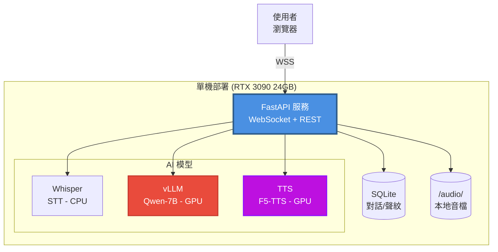

# AVATAR - MVP 技術規格（Linus 式精簡版）

> Version: 1.0.0
> Date: 2025-11-01
> Status: Active
> Owner(s): Lead Engineer (TL)
> Reviewers: PM, AI Engineer

---

## 1. 問題陳述與目標用戶

### 核心問題
**在單機有限資源（RTX 3090 24GB）下，實現低延遲（≤3秒）的全地端 AI 語音對話助手。**

### 目標用戶
1. 需要隱私保護的企業（金融、醫療、法律）
2. 對延遲敏感的應用場景（客服、培訓）
3. 語音品質有要求的內容創作者

### 成功指標（KPIs）
1. **E2E 延遲**: P95 ≤ 3.5 秒（50 字回應）
2. **系統穩定性**: 連續 2 小時 5 並發無 OOM
3. **音質滿意度**: 聲音克隆相似度主觀評分 ≥ 7/10

---

## 2. 高層設計

### 一句話架構
**FastAPI 單服務 + SQLite + 本地音檔 + 3 個 AI 模型（STT/LLM/TTS）調用**

### 組件圖



### 核心流程（F5-TTS 快速合成）
```
1. 用戶語音 → Whisper 轉文字 (≤600ms)
2. 文字 → vLLM 生成回應 (TTFT ≤800ms)
3. 回應 → F5-TTS 語音合成 (≤1.5s) → 立即播放
4. 存儲 → 對話歷史與音檔歸檔
```

### 資源分配
```
VRAM 24GB:
├── vLLM (常駐): 9-12GB
├── TTS (按需): 1-4GB
└── 余量: 8-14GB (並發/KV cache)

CPU/RAM:
├── Whisper: 8 cores, 8GB RAM
├── FastAPI: 4 cores, 4GB RAM
└── SQLite: 輕量級
```

---

## 3. 必要 API 契約

### 3.1 WebSocket API

**連接 URL**: `ws://localhost:8000/ws/chat`

| 消息類型 | 方向 | 格式 | 說明 |
|:---|:---|:---|:---|
| `audio_chunk` | Client → Server | `{type, data: base64, ts, sr}` | 語音片段（300ms） |
| `transcription` | Server → Client | `{type, text, is_final}` | 轉錄結果 |
| `llm_token` | Server → Client | `{type, token, turn_id}` | LLM 流式輸出 |
| `audio_response` | Server → Client | `{type, data: base64, mode}` | TTS 音頻（fast/hq） |
| `error` | Server → Client | `{type, code, message}` | 錯誤訊息 |

### 3.2 REST API

| 方法 | 路徑 | 說明 | 請求 | 回應 | 錯誤碼 |
|:---|:---|:---|:---|:---|:---|
| POST | `/api/voice-profile` | 上傳聲音樣本 | `multipart/form-data` | `{profile_id}` | 400/500 |
| GET | `/api/voice-profiles` | 列出聲音檔案 | - | `[{id, name, duration}]` | 500 |
| DELETE | `/api/voice-profile/{id}` | 刪除聲音檔案 | - | `{success: true}` | 404/500 |
| GET | `/api/conversations` | 獲取對話歷史 | `?limit=20` | `[{id, turns, created_at}]` | 500 |
| GET | `/health` | 健康檢查 | - | `{status, models}` | 503 |

---

## 4. 資料表 Schema

### 4.1 SQLite Schema（2 張表）

```sql
-- 對話記錄（核心表）
CREATE TABLE conversations (
    id INTEGER PRIMARY KEY AUTOINCREMENT,
    session_id TEXT NOT NULL,
    turn_number INTEGER NOT NULL,

    -- 用戶輸入
    user_audio_path TEXT NOT NULL,        -- audio/raw/{session_id}_{turn}.wav
    user_text TEXT NOT NULL,              -- 轉錄文字

    -- AI 回應
    ai_text TEXT NOT NULL,                -- LLM 生成文字
    ai_audio_path TEXT,                   -- audio/tts/{turn_id}.wav

    -- 元數據
    voice_profile_id INTEGER,             -- 使用的聲紋 ID
    created_at INTEGER NOT NULL,          -- Unix timestamp

    UNIQUE(session_id, turn_number)
);

CREATE INDEX idx_session_id ON conversations(session_id);
CREATE INDEX idx_created_at ON conversations(created_at);

-- 聲音檔案
CREATE TABLE voice_profiles (
    id INTEGER PRIMARY KEY AUTOINCREMENT,
    name TEXT NOT NULL,
    audio_path TEXT NOT NULL,             -- audio/profiles/{id}.wav
    embedding BLOB,                        -- 聲音特徵向量（256-dim）
    duration_sec REAL NOT NULL,
    created_at INTEGER NOT NULL,

    UNIQUE(name)
);

CREATE INDEX idx_voice_profile_name ON voice_profiles(name);
```

### 4.2 音檔存儲結構

```
audio/
├── raw/                       # 用戶原始錄音
│   └── {session_id}_{turn}.wav
├── profiles/                  # 聲音樣本
│   └── {profile_id}/
│       ├── reference.wav      # 參考音檔
│       └── reference.txt      # 參考文字
└── tts/                       # F5-TTS 合成輸出
    └── {turn_id}.wav
```

---

## 5. 前端範圍與路由

### 5.1 頁面/路由

| 頁面/路由 | 依賴 API | 核心組件 | 優先級 |
|:---|:---|:---|:---|
| `/chat` | `WS /ws/chat` | `ChatInterface`, `MicrophoneButton`, `AudioPlayer` | P0 |
| `/voice-profiles` | `GET/POST/DELETE /api/voice-profile` | `ProfileList`, `UploadDialog` | P0 |
| `/history` | `GET /api/conversations` | `ConversationList`, `TurnDetails` | P1 |

### 5.2 核心組件

```typescript
// 1. 聊天介面
<ChatInterface>
  ├── <MicrophoneButton onRecord={handleAudio} />
  ├── <MessageList messages={turns} />
  └── <AudioPlayer audioUrl={responseUrl} />
</ChatInterface>

// 2. 聲紋管理
<VoiceProfileManager>
  ├── <ProfileList profiles={profiles} onSelect={setActive} />
  └── <UploadDialog onUpload={handleUpload} />
</VoiceProfileManager>
```

---

## 6. 風險與手動替代方案

| 風險分類 | 描述 | 影響 | 替代/回退方案 |
|:---|:---|:---|:---|
| **VRAM OOM** | 並發 >5 會話導致顯存溢出 | 🔴 高 | - 限流：最多 5 並發<br>- 降級：純 Fast TTS<br>- 監控：實時 VRAM 告警 |
| **F5-TTS 載入慢** | 首次載入 5-10 秒 | 🟡 中 | - 預熱：啟動時預載<br>- 通知：顯示載入進度<br>- 降級：CPU 模式 |
| **台式口音誤字** | CER ~5-10% | 🟡 中 | - 後處理：簡單糾錯<br>- UI：可編輯轉錄文字<br>- 改進：收集數據微調 |
| **WebSocket 斷線** | 網路不穩定 | 🟢 低 | - 重連：Exponential Backoff<br>- 恢復：會話狀態持久化 |
| **SQLite 鎖定** | 高並發寫入 | 🟢 低 | - WAL 模式：提升並發<br>- 批量寫入：減少鎖競爭 |

---

## 7. 部署與監控

### 7.1 部署方式

#### 步驟 1: 安裝 Poetry

```bash
# Linux / macOS / WSL (推薦開發環境)
curl -sSL https://install.python-poetry.org | python3 -

# Windows (PowerShell)
(Invoke-WebRequest -Uri https://install.python-poetry.org -UseBasicParsing).Content | py -
```

**配置 PATH 環境變數**（Linux/macOS/WSL）:

```bash
# bash 用戶
echo 'export PATH="$HOME/.local/bin:$PATH"' >> ~/.bashrc
source ~/.bashrc

# zsh 用戶（macOS 預設）
echo 'export PATH="$HOME/.local/bin:$PATH"' >> ~/.zshrc
source ~/.zshrc
```

#### 步驟 2: 配置 Poetry（建議）

```bash
# 在專案目錄內建立虛擬環境（便於管理）
poetry config virtualenvs.in-project true
```

#### 步驟 3: 安裝專案依賴

```bash
# 進入專案根目錄
cd avatar/

# 安裝核心依賴
poetry install --no-root

# 或安裝所有依賴（包含可選項）
poetry install --no-root --all-extras
```

#### 步驟 4: 激活虛擬環境

**方法 A: 使用 Poetry 命令**（Poetry 2.0+ 推薦）
```bash
poetry env activate
# 執行顯示的命令，例如：
# source /path/to/.venv/bin/activate
```

**方法 B: 直接激活**
```bash
# Linux / macOS / WSL
source .venv/bin/activate

# Windows (Command Prompt)
.venv\Scripts\activate

# Windows (PowerShell)
.venv\Scripts\Activate.ps1
```

#### 步驟 5: 安裝 GPU 相關依賴（CUDA 版本）

**5.1 安裝 PyTorch (CUDA 12.1)**

```bash
# 方法 A: 在激活的 Poetry 環境中安裝（推薦）
# 確保已激活環境（見步驟 4）
pip install torch torchvision torchaudio --index-url https://download.pytorch.org/whl/cu121

# 方法 B: 使用 poetry run
poetry run pip install torch torchvision torchaudio --index-url https://download.pytorch.org/whl/cu121
```

**5.2 安裝 Flash-Attention（可選，提升性能）**

Flash-Attention 需要從源碼編譯，且需要在 Poetry 的虛擬環境中安裝。以下是跨平台的方法：

**方法 A: 使用 poetry shell（推薦，最簡單）**

```bash
# Linux / macOS / WSL
poetry shell
# 此時你已進入 Poetry 的虛擬環境，執行：
MAX_JOBS=4 pip install flash-attn --no-build-isolation --no-cache-dir
exit  # 退出 shell

# Windows PowerShell（PowerShell 不支持 MAX_JOBS= 語法）
poetry shell
$env:MAX_JOBS=4; pip install flash-attn --no-build-isolation --no-cache-dir
exit

# Windows CMD
poetry shell
set MAX_JOBS=4 && pip install flash-attn --no-build-isolation --no-cache-dir
exit
```

**方法 B: 手動激活虛擬環境**

```bash
# Linux / macOS / WSL
source .venv/bin/activate
MAX_JOBS=4 pip install flash-attn --no-build-isolation --no-cache-dir
deactivate

# Windows PowerShell
.venv\Scripts\Activate.ps1
$env:MAX_JOBS=4; pip install flash-attn --no-build-isolation --no-cache-dir
deactivate

# Windows CMD
.venv\Scripts\activate.bat
set MAX_JOBS=4 && pip install flash-attn --no-build-isolation --no-cache-dir
deactivate
```

**方法 C: 使用 poetry run（僅 Linux/macOS/WSL）**

```bash
# 注意: Windows PowerShell 不支援此語法
MAX_JOBS=4 poetry run pip install flash-attn --no-build-isolation --no-cache-dir
```

**說明**:
- `MAX_JOBS=4`: 限制編譯並行數，避免記憶體不足（可根據你的 RAM 調整，如 2/4/8）
- `--no-build-isolation`: 使用當前環境的編譯工具，而非建立隔離環境
- `--no-cache-dir`: 不緩存編譯產物，節省空間
- **編譯時間**: 首次安裝約需 10-30 分鐘，取決於 CPU 和記憶體
- **驗證安裝**: `poetry run python -c "import flash_attn; print('Flash-Attention installed successfully')"`

#### 步驟 6: 下載 AI 模型

> **新功能**: 腳本已重組為 Linus 式分類結構，使用主控制腳本簡化操作

```bash
# 方法 A: 使用主控制腳本（推薦）
./scripts/avatar-scripts setup-env

# 方法 B: 直接執行腳本
poetry run python scripts/setup/download_models.py
# 或在激活環境後：python scripts/setup/download_models.py

# 查看所有可用腳本功能
./scripts/avatar-scripts help
```

#### 步驟 7: 啟動後端服務

```bash
# 使用 Poetry run (推薦)
PYTHONPATH=src poetry run uvicorn avatar.main:app --host 0.0.0.0 --port 8000 --reload

# 或使用 Python 模組方式
PYTHONPATH=src poetry run python -m avatar.main

# 在激活環境後直接執行
source .venv/bin/activate  # Linux/macOS/WSL
PYTHONPATH=src uvicorn avatar.main:app --host 0.0.0.0 --port 8000 --reload
```

#### 步驟 8: 啟動前端（新終端）

```bash
cd frontend
npm install  # 首次執行
npm run dev
```

### 7.2 監控指標

| 指標 | 目標 | 監控方式 |
|:---|:---|:---|
| **E2E 延遲** | P95 ≤ 3.5s | 日誌統計 |
| **TTFT** | P95 ≤ 800ms | vLLM 內建指標 |
| **VRAM 使用率** | < 90% | `nvidia-smi` |
| **並發會話** | ≤ 5 | 內存計數器 |
| **錯誤率** | < 1% | 錯誤日誌統計 |

### 7.3 日誌格式

```python
# 結構化日誌（JSON）
{
    "timestamp": "2025-11-01T12:34:56Z",
    "level": "INFO",
    "trace_id": "uuid",
    "event": "tts_synthesis_complete",
    "duration_ms": 1230,
    "mode": "fast"
}
```

---

## 8. Gate 通過標準

### MVP 上線門檻

- [ ] **功能完整性**
  - [ ] 語音輸入 → LLM 對話 → 語音輸出完整流程可跑通
  - [ ] 聲音克隆功能可用（上傳/選擇/試聽）
  - [ ] 對話歷史可查看與重播

- [ ] **性能達標**
  - [ ] E2E 延遲 P95 ≤ 3.5s（50 字）
  - [ ] 連續 2 小時 5 並發無崩潰

- [ ] **品質保證**
  - [ ] 核心 API 有基本錯誤處理
  - [ ] WebSocket 斷線重連機制可用
  - [ ] 關鍵錯誤有日誌記錄

- [ ] **運維準備**
  - [ ] 部署腳本可用
  - [ ] 健康檢查端點 `/health` 正常
  - [ ] 音檔備份腳本就緒

---

## 附錄 A：技術選型決策（簡化 ADR）

### A1. 為什麼用 SQLite 而非 PostgreSQL？

**決策**: SQLite
**理由**:
- MVP 階段單機部署，不需要分佈式
- 零配置、零運維成本
- 性能足夠（< 1000 會話/天）
- 可隨時遷移至 PostgreSQL

**權衡**:
- ❌ 不支援高並發寫入（可接受，單機場景）
- ✅ 簡單、可靠、零依賴

---

### A2. 為什麼不用 Redis？

**決策**: 不用 Redis（MVP 階段）
**理由**:
- 會話狀態可用內存管理（< 5 並發）
- TTS 任務佇列可用 Python asyncio.Queue
- 減少外部依賴，降低部署複雜度

**升級條件**:
- 並發 > 10 會話時再引入 Redis

---

### A3. 為什麼不用 Clean Architecture？

**決策**: 單層架構（MVP 階段）
**理由**:
- 功能簡單，不需要 4 層抽象
- 開發速度優先
- 代碼量 < 2000 行，可維護

**重構時機**:
- 代碼量 > 5000 行
- 團隊 > 3 人
- 功能複雜度上升

---

### A4. 為什麼用 Poetry 而非 pip？

**決策**: Poetry
**理由**:
- **依賴鎖定**: `poetry.lock` 確保環境可複製（pip 的 `requirements.txt` 版本易飄移）
- **虛擬環境管理**: Poetry 自動建立與管理虛擬環境，無需手動 `venv`
- **依賴解析**: 自動解決依賴衝突，避免 "dependency hell"
- **現代化工具**: 遵循 PEP 518/621，是 Python 社群的最佳實踐
- **專案隔離**: ML 專案的 CUDA/PyTorch 版本管理更清晰

**權衡**:
- ❌ 需額外安裝 Poetry（一次性成本）
- ❌ GPU 依賴（PyTorch CUDA）需手動 pip 安裝（Poetry 無法處理 `+cu121` 版本號）
- ✅ 長期維護成本更低
- ✅ 團隊協作時環境一致性更好
- ✅ 可複製性高（對 ML 專案至關重要）

**常用指令**:
```bash
# 環境管理
poetry install --no-root          # 安裝依賴（非套件專案）
poetry install --all-extras       # 安裝所有可選依賴
poetry config virtualenvs.in-project true  # 本地 .venv

# 依賴管理
poetry add fastapi                # 新增依賴
poetry add --group dev pytest     # 新增開發依賴
poetry remove package             # 移除依賴
poetry show                       # 列出已安裝套件

# 執行
poetry env activate               # 顯示激活命令（Poetry 2.0+）
poetry run python app.py          # 在虛擬環境中執行
poetry run uvicorn app.main:app   # 啟動服務

# 環境資訊
poetry env info                   # 查看虛擬環境資訊
poetry env list                   # 列出所有虛擬環境
poetry env remove python          # 刪除虛擬環境
```

**已知問題與解決方案**:

1. **PyTorch CUDA 版本問題**
   - 問題: Poetry 無法解析 `torch==2.5.1+cu121` 格式
   - 解決: 使用 pip 手動安裝 PyTorch
   ```bash
   pip install torch torchvision torchaudio --index-url https://download.pytorch.org/whl/cu121
   ```

2. **Flash-Attention 編譯問題**
   - 問題: 需要從源碼編譯，耗時且易失敗
   - 解決: 限制並行編譯數或使用預編譯 wheel
   ```bash
   MAX_JOBS=4 pip install flash-attn --no-build-isolation --no-cache-dir
   ```

3. **Poetry 依賴解析緩慢**
   - 問題: 大型專案依賴解析可能需要數分鐘
   - 解決: 使用 `--no-root` 加速，必要時用 pip 安裝特定套件

---

## 附錄 B：目錄結構

```
avatar/
├── src/                     # Python 源碼 (符合 Python 包標準)
│   └── avatar/              # 主應用程式包
│       ├── __init__.py      # 包初始化
│       ├── main.py          # FastAPI 入口點
│       ├── api/             # API 端點層
│       │   ├── __init__.py
│       │   └── websocket.py # WebSocket 處理邏輯
│       ├── core/            # 核心功能模組
│       │   ├── __init__.py
│       │   ├── config.py    # 配置管理 (含多 GPU 支援)
│       │   ├── session_manager.py  # 會話管理
│       │   └── audio_utils.py      # 音頻處理工具
│       ├── services/        # AI 服務層
│       │   ├── __init__.py
│       │   ├── database.py  # SQLite 異步操作
│       │   ├── stt.py       # Whisper STT 服務
│       │   ├── llm.py       # vLLM 推理服務
│       │   └── tts.py       # F5-TTS 語音合成服務
│       └── models/          # Pydantic 資料模型
│           ├── __init__.py
│           └── messages.py  # WebSocket 消息模型
├── audio/                   # 音檔存儲 (運行時資料)
│   ├── raw/                 # 用戶原始錄音
│   ├── profiles/            # 聲音樣本檔案
│   └── tts/                 # F5-TTS 合成輸出
├── scripts/                 # Linus 式工具腳本管理
│   ├── avatar-scripts       # 主控制腳本 (統一入口)
│   ├── setup/               # 環境設置腳本
│   │   ├── download_models.py     # AI 模型下載
│   │   ├── validate_setup.py      # 環境完整性驗證
│   │   ├── init_database.py       # SQLite 資料庫初始化
│   │   ├── setup_cuda_wsl2.sh     # CUDA 環境設置 (Linux)
│   │   └── setup_cuda_wsl2.ps1    # CUDA 環境設置 (Windows)
│   ├── maintenance/         # 系統維護腳本
│   │   ├── cleanup_cache.sh       # 智能快取清理
│   │   ├── quick_cleanup.sh       # 快速清理
│   │   └── linux_resource_cleanup.sh  # 深度資源清理
│   ├── testing/             # 測試與驗證腳本
│   │   ├── test_model_loading.py  # AI 模型載入測試
│   │   ├── generate_test_audio.py # 測試音檔生成
│   │   ├── create_simple_test_audio.py  # 簡單音檔測試
│   │   └── run_tests.sh           # 完整測試套件
│   ├── development/         # 開發工具 (預留擴展)
│   └── README.md            # 腳本使用說明文檔
├── tests/                   # 測試程式碼
│   ├── unit/                # 單元測試
│   ├── integration/         # 整合測試
│   ├── websocket_e2e_test.py      # WebSocket E2E 測試
│   ├── e2e_pipeline_test.py       # 完整管道測試
│   └── quick_service_test.py      # 快速服務測試
├── docs/                    # 項目文檔
│   ├── planning/            # 規劃文檔
│   │   └── mvp_tech_spec.md # MVP 技術規格 (本文件)
│   ├── dev/                 # 開發文檔
│   ├── setup/               # 設置指南
│   └── launch/              # 部署指南
├── .claude/                 # TaskMaster 協作資料
│   ├── taskmaster-data/     # 任務管理資料
│   │   ├── project.json     # 專案配置
│   │   └── wbs-todos.json   # WBS 任務清單
│   ├── context/             # 上下文資料
│   └── hooks/               # 自動化鉤子
├── frontend/                # React 前端 (預留)
│   ├── src/
│   ├── public/
│   └── package.json
├── data/                    # 數據存儲
├── .venv/                   # Poetry 虛擬環境 (本地)
├── pyproject.toml           # Poetry 專案配置
├── poetry.lock              # 依賴版本鎖定
├── app.db                   # SQLite 資料庫檔案
├── .gitignore               # Git 忽略規則
├── CLAUDE.md                # TaskMaster 專案配置檔案
└── README.md                # 專案說明文檔
```

### pyproject.toml 範例

```toml
[tool.poetry]
name = "avatar-mvp"
version = "0.1.0"
description = "AI Voice Assistant - Local deployment with RTX 3090"
authors = ["Team <noreply@example.com>"]
readme = "README.md"
package-mode = false  # 非套件專案，僅依賴管理

# 環境要求說明:
# - Python: 3.11-3.12
# - CUDA: 12.1+ (系統安裝, 當前: 12.5/12.7)
# - GPU: RTX 3090 24GB (compute capability 8.6)
# - VRAM: 24GB

[tool.poetry.dependencies]
python = ">=3.11,<3.13"

# Web Framework
fastapi = ">=0.104.0"
uvicorn = {version = ">=0.24.0", extras = ["standard"]}
python-multipart = ">=0.0.6"  # 檔案上傳
websockets = ">=12.0"

# Database
aiosqlite = ">=0.19.0"  # Async SQLite

# AI Models (僅介面，實際透過外部服務)
# vLLM, faster-whisper, F5-TTS 需另外安裝

# Data Processing
numpy = ">=1.24.0"
pydantic = ">=2.0.0"
pydantic-settings = ">=2.0.0"

# Utilities
python-dotenv = ">=1.0.0"
aiofiles = ">=23.0.0"

[tool.poetry.group.dev.dependencies]
pytest = ">=7.4.0"
pytest-asyncio = ">=0.21.0"
black = ">=23.0.0"
ruff = ">=0.1.0"

# =============================================================================
# 環境設置指南 (Environment Setup Guide)
# =============================================================================
#
# 1. 安裝 Poetry:
#    curl -sSL https://install.python-poetry.org | python3 -
#    poetry config virtualenvs.in-project true
#
# 2. 安裝基礎依賴:
#    poetry install --no-root
#
# 3. 安裝 PyTorch (CUDA 12.1):
#    pip install torch torchvision torchaudio --index-url https://download.pytorch.org/whl/cu121
#
# 4. 安裝 AI 模型套件:
#    pip install vllm>=0.6.0
#    pip install faster-whisper
#    # F5-TTS 參考官方 repo 安裝
#
# 5. 驗證安裝:
#    python -c "import torch, vllm; print(f'PyTorch: {torch.__version__}, CUDA: {torch.cuda.is_available()}')"
#
# 當前開發環境:
# - OS: Windows 11 / WSL2 Ubuntu 22.04
# - CUDA: 12.5 (nvcc) / 12.7 (runtime)
# - GPU: NVIDIA RTX 3090 (24GB, compute capability 8.6)
# - Python: 3.11
# - PyTorch: 2.x+cu121 (向上相容)
# =============================================================================

[build-system]
requires = ["poetry-core"]
build-backend = "poetry.core.masonry.api"
```

**注意事項**:
- `package-mode = false`: 因為這是應用專案而非 Python 套件
- `--no-root`: Poetry 安裝時不嘗試安裝專案本身為套件
- GPU 依賴（PyTorch, vLLM）需在 Poetry 安裝後手動使用 pip 安裝

---

## 附錄 C：故障排除與常見問題

### C1. Poetry 安裝問題

**問題**: 執行 `poetry` 命令時顯示 "command not found"
**解決方案**:
```bash
# 確認 Poetry 已安裝
ls -la ~/.local/bin/poetry

# 如果存在，將路徑加入 PATH
echo 'export PATH="$HOME/.local/bin:$PATH"' >> ~/.bashrc
source ~/.bashrc

# 驗證
poetry --version
```

---

### C2. PyTorch CUDA 版本不匹配

**問題**: `torch.cuda.is_available()` 返回 `False`
**診斷步驟**:
```bash
# 1. 檢查 NVIDIA 驅動與 CUDA 版本
nvidia-smi

# 2. 檢查 PyTorch 版本
python -c "import torch; print(f'PyTorch: {torch.__version__}, CUDA Available: {torch.cuda.is_available()}')"

# 3. 重新安裝匹配的 PyTorch 版本
pip uninstall torch torchvision torchaudio
pip install torch torchvision torchaudio --index-url https://download.pytorch.org/whl/cu121
```

**常見原因**:
- CUDA 版本與 PyTorch 不匹配（例如 CUDA 12.1 卻安裝 CPU 版 PyTorch）
- Poetry 自動安裝了 CPU 版本（覆蓋了手動安裝的 CUDA 版）
- 系統未安裝 NVIDIA 驅動或 CUDA Toolkit

---

### C3. vLLM 安裝失敗

**問題**: `pip install vllm` 出現編譯錯誤
**解決方案**:
```bash
# 方法 1: 使用預編譯 wheel（推薦）
pip install vllm --find-links https://vllm-wheels.s3.us-west-2.amazonaws.com/nightly/vllm-latest-py3-none-any.whl

# 方法 2: 確保 CUDA 工具鏈完整
sudo apt install build-essential cuda-toolkit-12-1

# 方法 3: 降級到穩定版本
pip install vllm==0.5.4
```

---

### C4. VRAM 不足（OOM）

**症狀**:
- `torch.cuda.OutOfMemoryError`
- GPU 程序崩潰

**診斷與解決**:
```bash
# 1. 監控 VRAM 使用
watch -n 1 nvidia-smi

# 2. 檢查是否有其他程序佔用 GPU
nvidia-smi --query-compute-apps=pid,process_name,used_memory --format=csv

# 3. 殺死佔用 GPU 的程序（謹慎操作）
kill -9 <PID>

# 4. 降低模型並發數
# 在 config.py 中設定:
# MAX_CONCURRENT_SESSIONS = 3  # 從 5 降到 3
```

**預防措施**:
- 啟動時預載 vLLM 和 Fast TTS，確保有足夠 buffer
- 監控並發會話數，超過 5 個時拒絕新連線
- 使用量化模型（AWQ/GPTQ）減少 VRAM 佔用

---

### C5. WebSocket 連接失敗

**問題**: 前端無法連接到 WebSocket 端點
**診斷步驟**:
```bash
# 1. 檢查後端是否運行
curl http://localhost:8000/health

# 2. 檢查 WebSocket 端點
wscat -c ws://localhost:8000/ws/chat
# 如未安裝: npm install -g wscat

# 3. 檢查防火牆
# Windows:
netsh advfirewall firewall add rule name="FastAPI" dir=in action=allow protocol=TCP localport=8000

# Linux:
sudo ufw allow 8000/tcp
```

**常見原因**:
- CORS 設定錯誤（檢查 FastAPI CORS middleware）
- 防火牆阻擋 8000 端口
- 前端 WebSocket URL 錯誤（應為 `ws://` 而非 `http://`）

---

### C6. Flash-Attention 編譯失敗

**問題**: `pip install flash-attn` 編譯超時或錯誤

**診斷步驟**:
```bash
# 1. 確認在 Poetry 虛擬環境中
poetry env info

# 2. 檢查 CUDA 工具鏈
nvcc --version
python -c "import torch; print(f'CUDA Available: {torch.cuda.is_available()}')"
```

**解決方案**:

**方法 1: 在 Poetry 環境中限制並行編譯（減少記憶體使用）**

```bash
# Linux / macOS / WSL
poetry shell
MAX_JOBS=2 pip install flash-attn --no-build-isolation --no-cache-dir
exit

# Windows PowerShell
poetry shell
$env:MAX_JOBS=2; pip install flash-attn --no-build-isolation --no-cache-dir
exit

# Windows CMD
poetry shell
set MAX_JOBS=2 && pip install flash-attn --no-build-isolation --no-cache-dir
exit
```

**方法 2: 使用預編譯 wheel（如果可用）**

```bash
poetry shell
pip install flash-attn --find-links https://github.com/Dao-AILab/flash-attention/releases
exit
```

**方法 3: 降低並行數（記憶體不足時）**

```bash
# 如果 32GB RAM，嘗試 MAX_JOBS=2 或 1
poetry shell
MAX_JOBS=1 pip install flash-attn --no-build-isolation --no-cache-dir
exit
```

**方法 4: 跳過 Flash-Attention（性能略降）**

```bash
# Flash-Attention 是可選依賴，可以跳過
# vLLM 仍可運行，只是性能略降
```

**編譯要求**:
- CUDA 11.6+ 或 CUDA 12.x（需與 PyTorch CUDA 版本匹配）
- GPU Compute Capability ≥ 7.5（Turing 架構以上，RTX 3090 為 8.6 ✅）
- 編譯期間記憶體 >16GB（建議 32GB+）
- 磁碟空間 >10GB（用於編譯緩存）
- **必須在 Poetry 虛擬環境中編譯**（不要使用系統 Python）

**常見錯誤與解決**:
- `CUDA not found`: 確認 CUDA Toolkit 已安裝且路徑正確
- `Out of memory during compilation`: 降低 `MAX_JOBS` 至 1-2
- `gcc/g++ version mismatch`: 確保編譯器版本與 CUDA 兼容（建議 GCC 9-12）

---

### C7. SQLite 鎖定錯誤

**問題**: `database is locked`
**解決方案**:
```python
# 在 db.py 中啟用 WAL 模式
import sqlite3

conn = sqlite3.connect('app.db')
conn.execute('PRAGMA journal_mode=WAL')
conn.execute('PRAGMA busy_timeout=5000')  # 5秒超時
conn.close()
```

**原因**:
- 多個進程同時寫入 SQLite
- SQLite 預設使用 DELETE journal mode，並發性差

---

### C8. 模型下載失敗

**問題**: 模型下載超時
**解決方案**:
```bash
# 方法 1: 使用 HuggingFace 鏡像
export HF_ENDPOINT=https://hf-mirror.com
./scripts/avatar-scripts setup-env
# 或：python scripts/setup/download_models.py

# 方法 2: 手動下載並放置
# 1. 從 Hugging Face 下載模型
# 2. 放置到 ~/.cache/huggingface/hub/

# 方法 3: 使用代理
export HTTP_PROXY=http://127.0.0.1:7890
export HTTPS_PROXY=http://127.0.0.1:7890
./scripts/avatar-scripts setup-env
```

---

### C9. 驗證安裝完整性

**一鍵檢查腳本**:
```python
#!/usr/bin/env python3
"""validate_setup.py - 驗證環境安裝"""

import sys

def check_import(module_name, display_name=None):
    display_name = display_name or module_name
    try:
        mod = __import__(module_name)
        version = getattr(mod, '__version__', 'unknown')
        print(f"✅ {display_name}: {version}")
        return True
    except ImportError:
        print(f"❌ {display_name}: Not installed")
        return False

print("=== Core Dependencies ===")
check_import('fastapi', 'FastAPI')
check_import('uvicorn', 'Uvicorn')
check_import('pydantic', 'Pydantic')

print("\n=== AI Models ===")
torch_ok = check_import('torch', 'PyTorch')
if torch_ok:
    import torch
    print(f"   CUDA Available: {torch.cuda.is_available()}")
    if torch.cuda.is_available():
        print(f"   CUDA Version: {torch.version.cuda}")
        print(f"   GPU: {torch.cuda.get_device_name(0)}")

check_import('vllm', 'vLLM')
check_import('faster_whisper', 'faster-whisper')

print("\n=== Optional ===")
check_import('flash_attn', 'Flash-Attention')

print("\n=== Database ===")
check_import('sqlite3', 'SQLite3')

sys.exit(0)
```

執行驗證:
```bash
# 方法 A: 使用主控制腳本（推薦）
./scripts/avatar-scripts dev-validate

# 方法 B: 直接執行腳本
python scripts/setup/validate_setup.py
```

---

### C10. 取得協助

如果以上方法都無法解決問題：

1. **收集診斷資訊**:
```bash
# 系統資訊
uname -a
python --version
poetry --version

# GPU 資訊
nvidia-smi

# 依賴清單
poetry show
pip list

# 錯誤日誌
tail -n 100 logs/error.log
```

2. **查閱文檔**:
- vLLM: https://docs.vllm.ai/
- FastAPI: https://fastapi.tiangolo.com/
- Poetry: https://python-poetry.org/docs/

3. **GitHub Issues**:
- 搜尋是否有類似問題
- 提供完整的錯誤訊息與環境資訊

---

**審核記錄**:
- 2025-11-01: v1.0.0 - 初版完成（Linus 式精簡）
- 2025-11-01: v1.1.0 - 新增 Poetry 詳細配置與故障排除指南（參考 iSpan_LLM-One-Piece）
